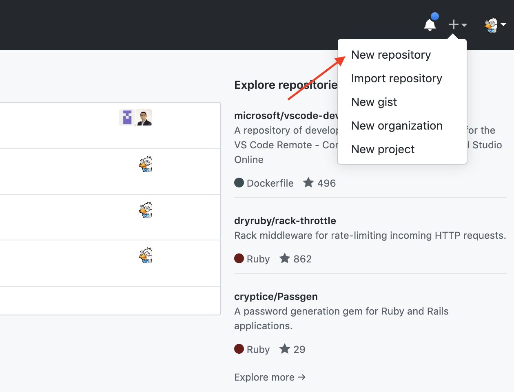
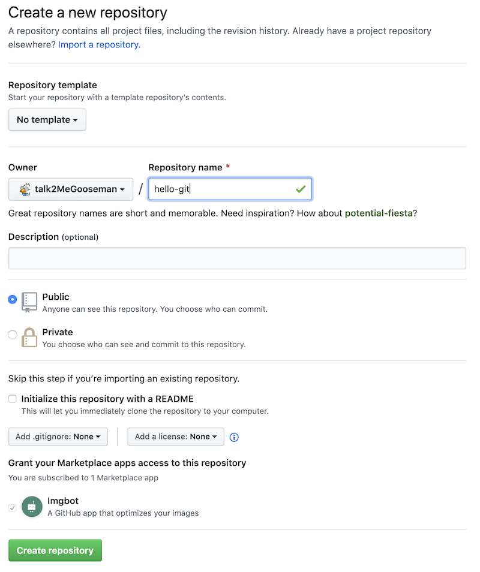

# Introduction to Git

From `git init` to `git push origin master` and more


## Erik (Gooseman) Guzman

- Senior Fullstack Engineer @ Coding Zeal
- Live Coder on Twitch.tv
- @Talk2MeGooseman


# What is a Version Control System (a.k.a Source Control Management)?

It is tool used to track changes in code and other text files. It also provides a running history of code development and help to resolve conflicts when merging contributions from multiple sources.


# How I like to internalize the idea

It's like journal or log of all the changes that you have made to file and you can go back in time to look at what thing use to look like.


# So why do we need a SCM?

We make mistakes all the time, it's only natural. So when a mistake does finally happen we're able to go back in time to our older changes and use those to fix or replace our problematic code.

https://git-scm.com/


# Introducing Git

Git is a free and open source distributed version control system designed to handle everything from small to very large projects with speed and efficiency.

*Erik's Opinion: it's pretty cool.*


# Why Git is cool

Git has a lot of cool features the make our development life easier like:

- Branches
- Distrubuted Development
- Pull Requests (Extra enhancement)

Dont worry if you dont understand any of this well touch on this things a much more.


# Getting Started with Git

You can install `git` by visting https://git-scm.com/downloads
This will install `git` in a command line interface that will be the main we will be using `git` for most of this workshop.


# Lets Make a Project

```
mkdir hello-git
```

```
cd hello-git
```

```
touch cool-file.md

echo $null >> cool-file.md
```

# Doing Our First Git Command

In order to use Git in any project, the first thing you need to do is initialize Git.
```
git init
```
The git init command creates a new Git repository. Running this command in any folder will create a Git repository and this is the very first command you use to get started with a new Git repo.

After running the command you should see something like the following in your terminal window.
```
Initialized empty Git repository in /blah/blah/blah/.git/
```

# Getting the Status of Your New Repository

Now we have a brand new repository cool, but how do we know whats going it with? Type:
```
git status
```

`git status` displays the state of our current work. It helps use know what files are new and files that have changes.

After running `git status` you should see something like this:

```
On branch master

No commits yet

Untracked files:
  (use "git add <file>..." to include in what will be committed)

        cool-file.md

nothing added to commit but untracked files present (use "git add" to track)
```

Now that we know there are some "Untracked file" what next?

# Getting Ready to do Our First Commit

But first, what is a `commit`?

If you're familiar with games, think of it like a check/save point in your game. When you make a commit, it takes a snapshot of your code at that point in time.

Let's try doing our first commit:

```
git commit -m 'HELLO COMMIT'
```

When you run the command something doesnt seem right though, you should see something like:
```
On branch master
Your branch is up to date with 'origin/master'.

Untracked files:
        cool-file.md

no changes added to commit
```

If you look at the last line it says `no changes added to commit`. We accidentally skipped an important step in the commit process. Before we can commit our files, we need to add them so they are `staged` for committing.

To `stage` a file you will need to use the following command:
```
git add <arguments>
```
This is another command you will need to use very often. If you need to `commit` you must first `add` files to be committed.

Lets add our file for `cool-file.md` for commit using the following command:
```
git add cool-file.md
```
Let's try checking the `status` of our repository since we just did the `add` command and see how things look.

```
git status
```

You should see something like this:
```
On branch master
Your branch is up to date with 'origin/master'.

Changes to be committed:
  (use "git restore --staged <file>..." to unstage)
        new file:   cool-file.md
```

If you read what `status` is telling you, you will see that it is telling you what files are going to be "committed" when your run `commit` command. Take a look under the line `Changes to be committed:`

Now that we have our `cool-file.md` added and ready for `commit`, let's run the command!


```
git commit -m 'HELLO COMMIT'
```

After running the command you should see something close to the following output below:
```
[master (root-commit) 837f2be] HELLO COMMIT
 1 files changed, 0 insertions(+), 0 deletions(-)
 create mode 100644 cool-file.md
```

If you inspect the output, you should see the commit message used, and the file(s) that were committed.

# Committing Changes to a File

We have success created a very first commit and added our `cool-file.md` to our repository history.

Wait, there is nothing in our `cool-file.md`! Lets try editing our file and committing the changes.

Run the following command so we can add some text to our new file.
```
echo 'this is an edit' >> cool-file.md
```

Now we want to `commit` our changes, but before we can `commit` you will have to `add` our file changes. But since we want to `commit` file changes we should use a different `add` command. You should use `add` with the `-p` argument.

Enter the following command:
```
git add -p
```

You should then see the following output asking you for input:
```
diff --git a/cool-file.md b/cool-file.md
index e69de29..1385f26 100644
--- a/cool-file.md
+++ b/cool-file.md
@@ -0,0 +1 @@
+this is an edit
Stage this hunk [y,n,q,a,d,e,?]?
```

## What the heck is `Stage this hunk [y,n,q,a,d,e,?]?`?

Yeah, whoa, that is some weird thing to read. If you dont enter anything in and just click the `enter/return` key you should see an explanation of wht all the arguments mean:
```
y - stage this hunk
n - do not stage this hunk
q - quit; do not stage this hunk or any of the remaining ones
a - stage this hunk and all later hunks in the file
d - do not stage this hunk or any of the later hunks in the file
.
.
.
```

What we want to do is `stage` our `hunk` to be committed. When ever we use git `add` were always staging file changes, `add -p` give his full control of what we want to `add` to our `commit`.

Let's stage our file change by entering in `y`.

```
Stage this hunk [y,n,q,a,d,e,?]? y
```

Now lets just do a `status` check and make sure our file change(s) are staged and ready to be committed.
```
git status
```

The `status` should confirm that `cool-file.md` is ready for commit.

```
Changes to be committed:
  (use "git reset HEAD <file>..." to unstage)

        modified:   cool-file.md
```

Let's create a new commit.

```
git commit -m 'Added some text to cool-file'
```

# How to Never Commit Certain Files

Let's now create a brand new file called `super-secret-file.md`. This file is going to have some super secret stuff we NEVER want to `commit`. Since Git remembers everything we ever `commit`, it will make it super easy for someone to look into our history and find out what's inside our secret file.

```
touch super-secret-file.md
# Or on powershell
echo $null >> super-secret-file.md
```

After creating our file, let's check the `status` of our current changes.

```
git status
```

We should see the following:

```
Untracked files:
  (use "git add <file>..." to include in what will be committed)

        super-secret-file.md
```


Uh oh, we can see that git sees our new `super-secret-file.md`. Even though were not going to try to `add` this file, but what happens in the future if we forget and accidentally do?

There is a way to have Git to never ever allow this file to be committed. Enter the `.gitignore` file.

In a `.gitignore` file you will list all the files you want Git to ignore and never include an any future commit.

Now let's make a `.gitignore`.

```
touch .gitignore
# or if powershell
echo $null >> .gitignore
```

Next we need to add `super-secret-file.md` to our `.gitignore`.

```
echo super-secret-file.md >> .gitignore
```

Now thats done, let's check the  `status` and see what Git says now.

```
git status
```

We should get:

```
Untracked files:
  (use "git add <file>..." to include in what will be committed)

        .gitignore
```

Oh hey! No more `super-secret-file.md` but we do have `.gitignore` file now. Mission accomplished! Now our super secret files will never have the chance to be committed. Remember to do this any time you have files you never want to be committed to Git.

Let's `commit` our changes, first `add` our file.

```
git add .gitignore
```

Now for the `commit`.

```
git commit -m 'Adding in the gitignore'
```

# Using Github as our online backup

Up till this point all your work has been on your local git repository living on your computer. This is ok till something goes wrong on your computer and the result might be losing all your work and the history of all the changes you ever made.

## Enter Github

GitHub is a development platform inspired by the way you work. From open source to business, you can host and review code, manage projects, and build software.

It's like a Dropbox/Google Drive/Whatever file backup system but for CODE! With a ton of cool features and collaboration tools.

Now let's create an account if you dont have one


---

# Creating a repo steps




