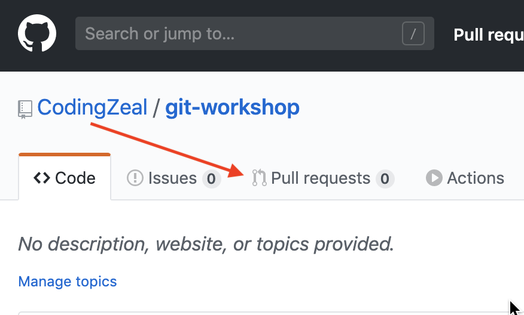
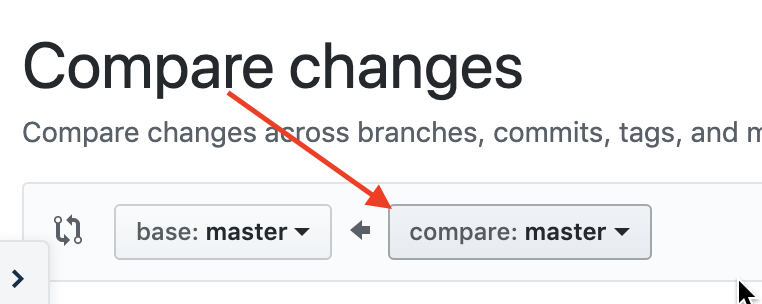

# Creating a Pull Request on Github

First, what is a `Pull Request`?

> Pull requests let you tell others about changes you've pushed to a branch in a repository on GitHub. Once a pull request is opened, you can discuss and review the potential changes with collaborators and add follow-up commits before your changes are merged into the base branch. https://help.github.com/en/github/collaborating-with-issues-and-pull-requests/about-pull-requests

Let's try going through an example of making one so this make more sense.

Create a new `branch` so we can called `more-super-cool-edits`.

```
git checkout -b more-super-cool-edits
```

Check the output to make sure everything worked:

```
Switched to branch 'more-super-cool-edits'
```

## Making an edit to `cool-file.md` on `more-super-cool-edits`

Open `cool-file.md` and let's change the whole file.

```
This is a super cool file so it should have super cool text!

ZEAL is awesome!
```

Once we have our changes and saved the file, let's go through our `commit` cycle:

```
git add -p
```

Confirm all your changes and `commit`.

```
git commit -m 'Making a change the will conflict'
```

Double check the `commit` was a success:

```
[master 307204c] Making a change the will conflict
 1 file changed, 2 insertion(+), 0 deletion(-)
```

## Pushing our New Branch to Github

Now in order to create a `pull request` we need to make sure our `branch` is `push`ed to Github so it know about it. Just like with pushing `master` to our `origin` we will do the same with our `more-super-cool-edits`.

```
git push origin more-super-cool-edits
```

The output should look similar to this:

```
remote:
remote: Create a pull request for 'more-super-cool-edits' on GitHub by visiting:
remote:      https://github.com/YOUR_ACCOUNT/git-workshop/pull/new/more-super-cool-edits
remote:
To github.com:CodingZeal/git-workshop.git
 * [new branch]      more-super-cool-edits -> more-super-cool-edits
 ```

Git is telling us in the above output where it pushed our new branch and what its called. Any time we make changes to our branch and want those changes to be on Github we will have to do the same action again.

## Creating the Pull Request

Now that the branch has been pushed to Github, let's had over to your Github where you repository lives.

Click on `Pull requests`


Click `New pull request`


Select the compare dropdown



Now select our branch `more-super-cool-edits`

From here Github will compare the changes on your `more-super-cool-edits` and `master` branch. This is super awesome to see all the changes that `more-super-cool-edits` will be introducing.

Click `Create pull request`.

Now we have a `Pull Request` other people can see and review. They can look at changes you are making and provide feedback or approval. Another cool thing about this feature is that if all the changes look good you can merge the changes from `more-super-cool-edits` into `master` directly on Github!

