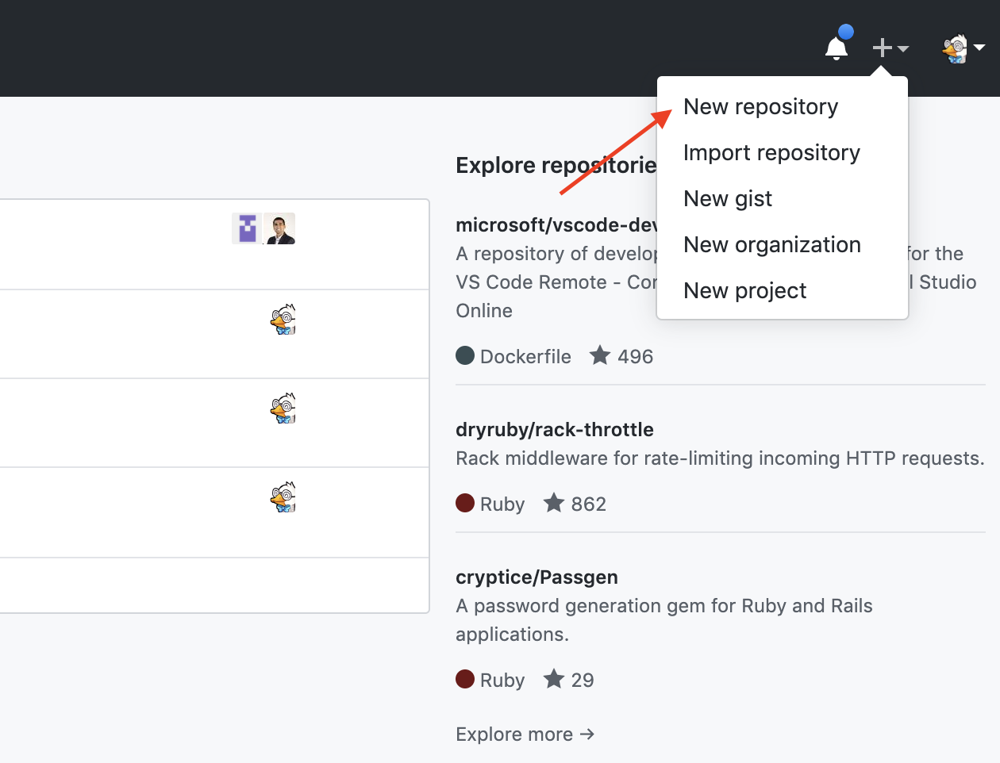
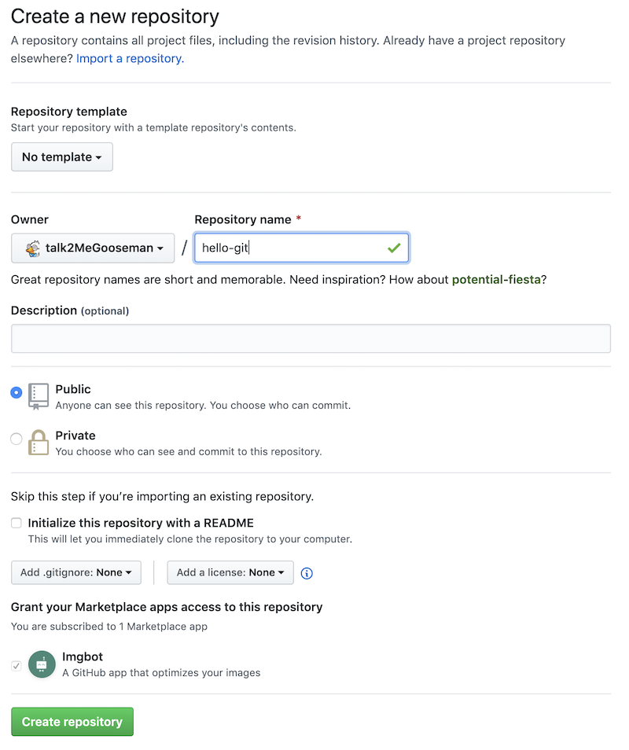

# Using Github as our online backup

Up till this point all your work has been on your local git repository living on your computer. This is ok till something goes wrong on your computer and the result might be losing all your work and the history of all the changes you ever made.

## Enter Github

GitHub is a development platform inspired by the way you work. From open source to business, you can host and review code, manage projects, and build software.

It's like a Dropbox/Google Drive/Whatever file backup system but for CODE! With a ton of cool features and collaboration tools.

Now let's create an account if you dont have one

## Creating a repo steps

Now that you have an account let's make a brand new repository that will be the home to our local Git repository.

When creating the repository I like to name the repository the same name as the project directory locally. In this case `hello-git`.

You can keep everything else the same and click `Create Repository`.

[Next](github-push.md)
